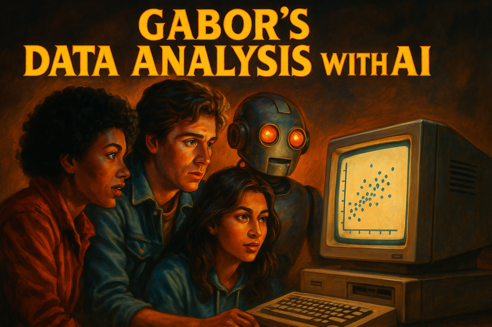
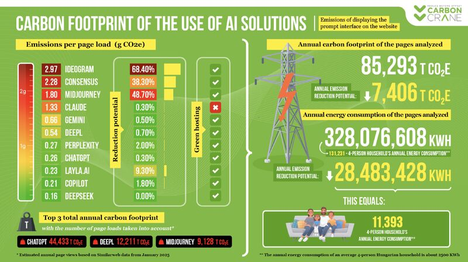

# Doing Data Analysis with AI

**Author**: [Gábor Békés](https://sites.google.com/site/bekesg/), Central European University (Austria, EU)

**Version**: v.0.4. 2025-04-04 

## What's this

This course will equip students, who are already versed in core data analysis methods, with experience to harness AI technologies to improve productivity (*yes this is classic LLM sentence*). But, yeah, the idea is to help students who studied data analysis / econometrics / quant methods and want to think about **how to include AI in their analytics routine**, and spend time to share experiences. 

As AI becomes more and more powerful, it is also important to provide a platform to **dicuss human agency in data analysis**. So a key element of the course and its instructor to lead discussions on the role of AI and humans in various aspects of data analysis. 

## COURSE DESCRIPTION

### Content

The course focuses on using large language models (LLMs) such as OpenAI's ChatGPT, Anthropic Claude.ai, Mistral's Le Chat, and Google's Gemini) to **carry out tasks in data analysis**. It includes topics like data extraction and wrangling, data exploration and descriptive statistics, and creating reports as well as turning text to data. 

There are three **case studies** that we use (1) a simulated set of data tables on hotels in Austria, (2) The World Value Survey, and (3) A series of interview textst. 

The course material includes weekly practice **assignments**. 

### Background

You need a background in **Data Analysis / Econometrics**, a good introductory course is enough. I, *of course*, suggest Chapters 1-12 and 19 of [Data Analysis for Business, Economics and Policy (Cambridge UP, 2021)](https://gabors-data-analysis.com/getting-started). Full slideshows, data and code are open source. But consider buying the book. 
In particular, the course builds on [Chapters 1-6 and 7-10, and 19 of Data Analysis ](https://gabors-data-analysis.com/chapter-details/) but other Introductory Econometrics + basics of data science knowledge is ok.

Students are expected to have some basic **coding knowledge** in Python or R (Stata also fine mostly). 

### Relevance

AI is everywhere and has become essential, most analytical work will be using it.

### Learning Outcomes

Key outcomes. By the end of the course, students will be able to

* Gain experience and confidence using genAI to carry out key tasks in data analysis.
* Build AI in coding practice including data wrangling, description and reporting and text analysis
* Have some idea of use cases when AI assistance is (1) greatly useful, (2) helpful, (3) currently problematic. 
* Have some idea of use cases when AI assistance is OK to use as is vs needs strong human supervision
* Have an understanding of resources to follow for updates. 

### Target audience

This is a couse aimed at 3rd (2nd?) year BA and (A students) in any program with required background. 

But, anyone can use it with adequate background. 

### Assignments

Assignments are available for all classes

**Important to note for assignments: **
* Use AI but do not submit something that was created by AI. AI is your assistant.
* One of the goals of the course is to practice this. 

## Week01: LLM Review

What are LLMs, how is the magic happening. A non-technical brief intro. How to work with LLMs? Plus ideas on applications. Includes suggested readings, podcasts, and vids to listen to. 

[Content](/week01)

**Which AI?** See [my take on current models](week01/assets/which-ai.md). As of *May 2025*. 

## Week02: Data and code discovery and documentation with AI

Learn how to write a clear and professional code and data documentation. LLMs are great help once you know the basics. 

Case study: World Values Survey. Data is at [WVS](/data/VWS)

[Content](/week02)

## Week 03: Writing Reports

You have your data and task, and need to write a short report. We compare different options with LLM, from one-shot prompt to iteration. 

Case study: World Values Survey. Data is at [WVS](/data/VWS)

[Content](/week03)

## Week04: Data wrangling, joining tables

When asked about what I shall add to my textbook, David Card, the Nobel winning empirical economist told me that I shall spend time with joining tables. Here we go. 

Case study: simulated Austrian hotels. Data is at [hotels](/data/austria-hotels)

[Content](/week04)

## Week05: Text as data 1 -- intro lecture

No course of mine can escape football (soccer). Here we look at post-game interviews to learn basics of text analysis and apply LLMs in what they are best - context dependent learning. Two class series. First is more intro to natural language processing. 

Case study: football post-game interviews. Data is at [interviews](/data/interviews)

[Content](/week05)

## Week06: Text as data 2 -- practice

Second class, now we are in action. How does LLM compare to humans? 

Case study: football post-game interviews. Data is at [interviews](/data/interviews)

[Content](/week06)

## Learn more

I'm adding material to [learn-more](/learn-more) folder. You can start with the [beyond](/learn-more/beyond.md) page. 

---

## Rights and acknowledgement 

## You can use it to teach and learn freely

**Attribution**: Békés, Gábor: "Doing Data Analysis with AI: a short course", available at [github.com/gabors-data-analysis/da-w-ai/](https://github.com/gabors-data-analysis/da-w-ai/), v0.5, 2025-05-14

**License**: [CC BY-NC-SA 4.0](https://creativecommons.org/licenses/by-nc-sa/4.0/) -- share, attribute, non-commercial (contact me for corporate gigs)

## Thanks

**Thanks:** Developed mostly by [me, Gábor Békés](https://bsky.app/profile/gaborbekes.bsky.social) Thanks a million to the two wonderful human RAs, [Ms Zsuzsa Vadle](https://bsky.app/profile/zsuzsannavadle.bsky.social) and [Mr Kenneth Colombe](https://bsky.app/profile/kcolombe24.bsky.social), both Phd students. Thanks to Claude.ai that did a great deal of help in creating the simulated dataset. ChatGPT and Claude.ai helped create the slideshows and educated *me* on NLP. 

Thanks for CEU's teaching grant that allowed me pay humans and AI. 

## Questions and suggestions

This material is based my course at CEU in Vienna, Austria. I teach it from this Github repo. 

If you have questions or suggestions or interested to learn more, just [fill in this form](https://docs.google.com/forms/d/e/1FAIpQLSev0oaR2s71hvFTZjhTwCuCPL00ljYWAIjl0hoZQLTn_oG3KQ/viewform?usp=header).

## And now, this.

AI use is very costly in terms of energy. Yes, it is becoming cheaper. But humanity is also using *much* more of it. 

