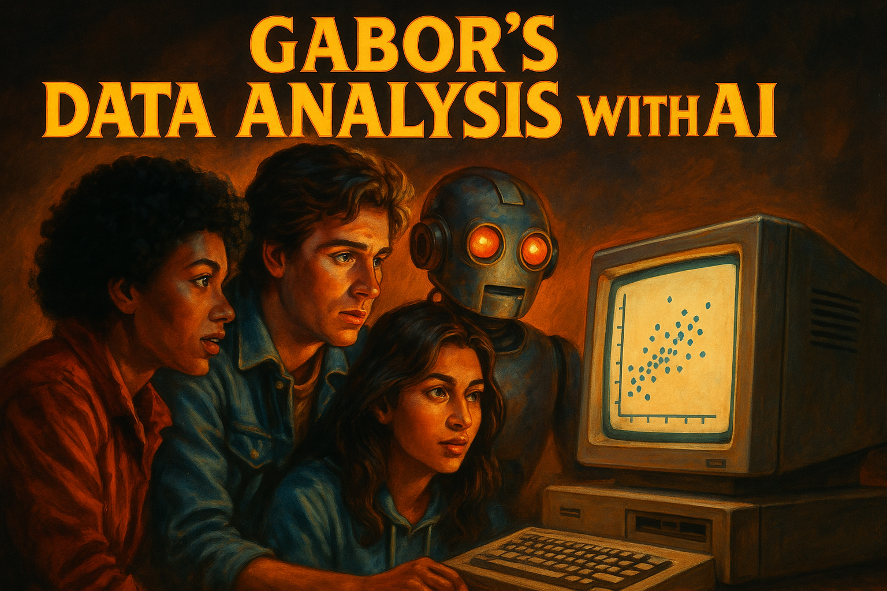

## What's this

This course will equip students, who are already versed in core data analysis methods, with experience to harness AI technologies to improve productivity (*yes this is classic LLM sentence*). But, yeah, the idea is to help students who studied data analysis / econometrics / quant methods and want to think about **how to include AI in their analytics routine**, and spend time to share experiences. 

As AI becomes more and more powerful, it is also important to provide a platform to **discuss human agency in data analysis**. So a key element of the course and its instructor to lead discussions on the role of AI and humans in various aspects of data analysis. 

**This is the 2026 Spring edition release**

### For whom?

This material is aimed at data science and analytics instructors who can guide their students through the material sharing the experience and domain specific examples. All of this is open source, may be modified (see rights below).

But, dear reader (students, practitioners, researchers, journalists and more), you can also go alone, checking ideas and practice sessions. 

### AI and me

At the end of all classes, instructors and students should always consider these three questions. 

1. How did AI **support** me do what I planned.
2. How did AI **fail** me: gave half-truths, buggy code, imprecise arguments
3. How did AI **extend** me: helped do things I could not, or gave new ideas 

## Course description

### Content

The course focuses on using large language models (LLMs — ChatGPT, Claude, Gemini, Le Chat and others) to **carry out tasks in data analysis**: data extraction and wrangling, exploration and description, reporting, and turning text into data. It ends with a three-session **capstone project** where small teams build a full analysis from scratch.

There are three **case studies** used across the weekly material: (1) a simulated set of data tables on hotels in Austria, (2) the World Values Survey, and (3) a series of interview texts. The capstone adds a fourth: football manager changes.

The course material includes weekly practice **assignments** and a [learning-more collection](da-knowledge/beyond.html) with blogs, papers, and video recommendations.

### Background: data analysis / econometrics

You need a background in **Data Analysis / Econometrics**, a good introductory course is enough. I, *of course*, suggest Chapters 1-12 and 19 of [Data Analysis for Business, Economics and Policy (Cambridge UP, 2021)](https://gabors-data-analysis.com/getting-started). Full slideshows, data and code are open source. But consider buying the book!🤝 

In particular, the course builds on [Chapters 1-6 and 7-10, and 19 of Data Analysis ](https://gabors-data-analysis.com/chapter-details/) but other Introductory Econometrics + basics of data science knowledge is ok.

### Background: coding

Students are expected to have some basic **coding knowledge** in Python or R (Stata also fine mostly). 

### Relevance

AI is everywhere and has become essential, most analytic work will be using it. It's like the Internet a while back. Does not solve all problems, but almost all intellectual tasks will rely on inputs from it. 

### Learning Outcomes

Key outcomes. By the end of the course, students will be able to

* Gain experience and confidence using genAI to carry out key tasks in data analysis.
* Build AI in coding practice including data wrangling, description and reporting and text analysis
* Have some idea of use cases when AI assistance is OK to use as is vs needs strong human supervision
* Have an understanding of resources to follow for updates.
* Run a multi-week team project from data collection to causal analysis, using AI throughout.

### Target audience

This is a course aimed at 3rd (2nd?) year BA and MA students in any program with required background. Economics, Quantitative Social science, Political Science, Sociology, History. To be frank, all students shall learn data analysis and be comfortable using AI. 

But, anyone can use it with adequate background. 

## Assignments

Assignments are available for all classes

Important to note for assignments: 
* Use AI but do not submit something that was created by AI. AI is your assistant.
* One of the goals of the course is to practice this. 

## Content

**Week00: AI for coding**

Using AI for code. May not be covered in this class, as it had often been already covered in coding classes. 

[Content](week00)

**Week01: LLM Review**

What are LLMs, how is the magic happening. A non-technical brief intro. How to work with LLMs? Plus ideas on applications. Includes suggested readings, podcasts, and vids to listen to. See also [which AI model to use](da-knowledge/which-ai.html).

[Content](week01/)

**Week02**: Data and code discovery and documentation with AI

Learn how to write a clear and professional code and data documentation. LLMs are great help once you know the basics. 

Case study: [World Values Survey](case-studies/VWS/)

[Content](week02/)

**Week 03**: Writing Reports

You have your data and task, and need to write a short report. We compare different options with LLM, from one-shot prompt to iteration. 

Case study: [World Values Survey](case-studies/VWS/)

[Content](week03/)

**Week04**: Agentic AI with Claude Code

From chat to terminal - introducing Claude Code for data analysis. Students learn to use agentic AI that works directly with files, generates data, and iterates on analysis.

Case study: [Austrian Hotels](case-studies/austria-hotels/)

[Content](week04/)

**Week05**: Advanced CLI Workflows

Going deeper with CLI tools: custom skills, project-specific instructions (CLAUDE.md), git integration, and autonomous execution. Turning CLI tools from clever assistants into reproducible research companions.

[Content](week05/)

**Week06**: From Data to Report

Download real CPS earnings data via CLI, contrast an undirected "vibe report" with a carefully directed economics-quality report. Iterative graph refinement, OLS regressions, and constrained PDF output.

Case study: [US Earnings (CPS)](case-studies/earnings/)

[Content](week06/)

**Week07**: Text as data 1 -- intro lecture

No course of mine can escape football (soccer). Here we look at post-game interviews to learn basics of text analysis and apply LLMs in what they are best - context dependent learning. Two class series. First is more intro to natural language processing.

Case study: [Football Manager Interviews](case-studies/interviews/)

[Content](week07/)

**Week08**: Sentiment Analysis with AI

Second class, now we are in action. How does LLM compare to humans?

Case study: [Football Manager Interviews](case-studies/interviews/)

[Content](week08/)

**Week09**: AI as research companion: Control variables

[Content](week09/)

**Week10**: AI as research companion: Instrumental variables

[Content](week10/)

### Capstone Project (3 sessions)

A three-session team project on manager changes in football: collect data, build a news-based expectation score with APIs, and run a Difference-in-Differences analysis.

**Session 1**: Project intro + data collection & description — [Content](project01/)

**Session 2**: From text to expectations (scraping + LLM APIs) — [Content](project02/)

**Session 3**: Difference-in-Differences analysis + final presentation — [Content](project03/)

## Knowledge Base

Reusable reference pages on APIs, tools setup, project design, and more — see the [Knowledge Base](navbar/resources.html). For further reading beyond the course, check the [beyond](da-knowledge/beyond.html) page.

---

## Rights and acknowledgement

### You can use it to teach and learn freely

**Attribution**: Békés, Gábor: "Data Analysis with AI: a comprehensive course", available at [gabors-data-analysis.com/ai-course/](https://gabors-data-analysis.com/ai-course/), v2.1. 2026-04-13.

You can fork it from the Github Repo.  [github.com/gabors-data-analysis/da-w-ai/](https://github.com/gabors-data-analysis/da-w-ai/)

**License**: [CC BY-NC-SA 4.0](https://creativecommons.org/licenses/by-nc-sa/4.0/) -- share, attribute, non-commercial (contact me for corporate gigs)

**Textbook** Please check out the [textbook](https://gabors-data-analysis.com/getting-started) behind all this, buy it if you can. If interested teaching contact the [Cambridge UP](https://www.cambridge.org/highereducation/books/data-analysis-for-business-economics-and-policy/D67A1B0B56176D6D6A92E27F3F82AA20#overview) or me. 

## Thanks

**Thanks:** Developed mostly by [me, Gábor Békés](https://sites.google.com/site/bekesg/) Thanks a million to the two wonderful human RAs, [Ms Zsuzsanna Vadle](https://bsky.app/profile/zsuzsannavadle.bsky.social) and [Mr Kenneth Colombe](https://bsky.app/profile/kcolombe24.bsky.social), both Phd students. Also thanks to [Adam Víg], long term collaborator now at Google. Thanks to Claude and ChatGPT to craft pages, improve consisency, create the simulated dataset. They helped create the slideshows and educated *me* on a bunch of topics like reinforcement learning or NLP. This is a beautiful example of collaboration with great young people while heavily benefiting from advanced AI. Thanks for [Quarto](https://quarto.org/) -- it was all drafted and written in Quarto and Rstudio by Posit. Plus all the love from Github. 

Thanks for CEU's teaching grant that allowed me pay people and AI. 

## Questions and suggestions

This material is based my course at CEU in Vienna, Austria. Here is the [Github repo](https://github.com/gabors-data-analysis/da-w-ai)

If you have questions or suggestions or interested to learn more, just [fill in this form](https://docs.google.com/forms/d/e/1FAIpQLSev0oaR2s71hvFTZjhTwCuCPL00ljYWAIjl0hoZQLTn_oG3KQ/viewform?usp=header).

## And now, this.

