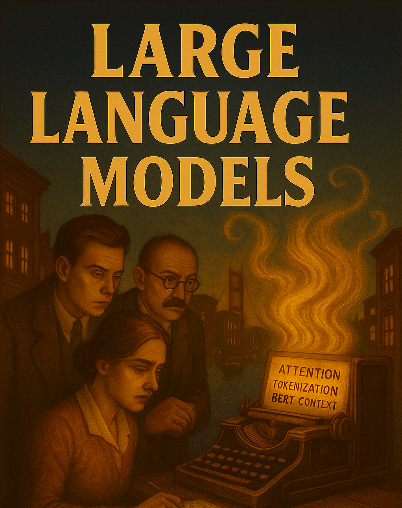

::::::: {.hero-section}
:::::: {.container}
::: {.hero-title}
Week 1 — LLMs, Models & Harnesses
:::

::: {.hero-subtitle}
The model landscape, what a harness is, and getting Claude Code + VS Code/Copilot working
:::
::::::
:::::::

------------------------------------------------------------------------



This is the opening week of the course — the one front-facing, lecture-heavier session. By the end you understand the model landscape (including open-weights models), what a harness is and why it matters, and you have **both course harnesses working** on your machine.

------------------------------------------------------------------------

## Before you come to class (30–60 min)

::::: {.week-card .card}
::: card-header
✅ **Pre-class checklist**
:::

::: card-body

- ☐ **Accounts** — create an Anthropic/Claude account and confirm GitHub Copilot access. Install VS Code.
- ☐ **Installs** — follow [Installing AI CLI Tools](../da-knowledge/install-cli.qmd) and the [VS Code + Copilot setup guide](../da-knowledge/vscode-setup.qmd). New to the terminal? Skim [Terminal Basics](../da-knowledge/terminal-basics.qmd).
- ☐ **Read** — [Which AI model](../da-knowledge/which-ai.qmd). That's the only required reading.

That's enough. We finish setup together in class.

:::
:::::

------------------------------------------------------------------------

## Learning objectives

By the end of this unit you will be able to:

- Explain what an LLM is, what a context window is, and why both matter for data work.
- Distinguish closed/frontier models from **open-weights** models and say when each is the right choice.
- Explain what a **harness** is and why it matters as much as the model.
- Run an identical small task across **Claude Code (terminal + desktop)** and **VS Code + Copilot**, and articulate the differences.

------------------------------------------------------------------------

## Session shape (200 min · 50·50·40·40·20)

| Chunk | Focus | Mode |
|---|---|---|
| 1 (50) | LLMs & the model landscape | Talk |
| 2 (50) | Harnesses, open-code, open-weights | Talk |
| 3 (40) | Hands-on: Claude Code (terminal + desktop) | Individual |
| 4 (40) | Hands-on: VS Code + Copilot + the comparison | Individual |
| Discussion (20) | Surfaces, trust, the jagged frontier | Group |

------------------------------------------------------------------------

## Chunk 1 — LLMs & the model landscape (50 min · talk)

::::: {.week-card .card}
::: card-header
📊 **Core LLM concepts**
:::

::: card-body

**[Slideshow: LLM Concepts and Applications](https://gabors-data-analysis.com/courses/da-w-ai-2025/da-w-ai-01-llm-course.html)**

- **What an LLM is** — a statistical model predicting the next token from massive training data.
- **The transformer revolution** — how 2017's *"Attention is All You Need"* made today's models possible.
- **Context windows** — what they are and why they shape every data-analysis workflow.
- **Training & feedback** — pre-training, resources, and human feedback (RLHF); why models differ.
- **The jagged frontier** — where LLMs excel and where they quietly fail. See [Mollick on the shape of AI jaggedness](https://www.oneusefulthing.org/p/the-shape-of-ai-jaggedness-bottlenecks).
- **Cyborg vs Centaur** — two ways to split work with AI (Mollick): the *Centaur* hands off whole sub-tasks; the *Cyborg* interleaves human and AI move-by-move. You'll feel both this term.

**The model landscape (see [Which AI model](../da-knowledge/which-ai.qmd)):**

- **Frontier closed models** — Claude, GPT, Gemini. State of the art, rented per token.
- **Open-weights models** — Llama, Qwen, Mistral, DeepSeek, Kimi. Download and run yourself; roughly SOTA-minus-a-few-months. Why they matter: **privacy, cost at scale, reproducibility**. Full orientation in [Open-weights & local models](../da-knowledge/open-weights-models.qmd).

:::
:::::

------------------------------------------------------------------------

## Chunk 2 — Harnesses, open-code & open-weights (50 min · talk)

::::: {.week-card .card}
::: card-header
🔧 **The model is the engine; the harness is the car**
:::

::: card-body

A **harness** wraps a model and lets it actually *do* things — read your files, run code, edit files, iterate. The harness matters as much as the model.

**This course uses exactly two harnesses:**

| Harness | Surfaces | Notes |
|---|---|---|
| **[Claude Code](https://docs.anthropic.com/en/docs/claude-code/overview)** | Terminal **and** desktop app | Terminal-native agent that sees your project, runs code, iterates. |
| **VS Code + [GitHub Copilot](https://docs.github.com/copilot)** | IDE | In-editor assistance; you can point it at different backing models. |

That's it — no other tools to learn. Everything transfers conceptually to alternatives.

**Two awareness topics (not required to install):**

- **[Open-code tools](../da-knowledge/open-code-tools.qmd)** — open-source agentic harnesses you run yourself and point at any model.
- **[Open-weights / local models](../da-knowledge/open-weights-models.qmd)** — running a private, frozen model locally (e.g. via Ollama), and pointing a harness at it.

**IDE assistance vs terminal-native execution** — the jump this course makes is not "AI vs no AI." It's about *where* the AI runs and how tight the loop is. Copilot keeps you in the editor; a CLI agent compresses the ask→run→inspect→fix loop into one place.

:::
:::::

------------------------------------------------------------------------

## Chunk 3 — Hands-on: Claude Code (40 min · individual)

::::: {.week-card .card}
::: card-header
🖥️ **Same task, two surfaces — terminal then desktop**
:::

::: card-body

1. **Install & authenticate Claude Code in the terminal** (finish [Installing AI CLI Tools](../da-knowledge/install-cli.qmd) if needed). Open a terminal, make a folder, and launch:

```bash
mkdir my-first-agent && cd my-first-agent
claude
```

2. **A first real task.** Try a tiny data-search prompt and verify the result against reality:

```
Get me an income dataset by planning region (county) in Connecticut for 2023.
Present the results as a table I can copy and edit.
```

   Then **find the actual data and compare.** Try it more than once; tweak the prompt to be more specific.

3. **Now do the same thing in the Claude desktop app.** Notice what changes between terminal and desktop: file access, permissions, how you see the work.

:::
:::::

------------------------------------------------------------------------

## Chunk 4 — Hands-on: VS Code + Copilot + the comparison (40 min · individual)

::::: {.week-card .card}
::: card-header
🧩 **The IDE harness**
:::

::: card-body

1. **Set up VS Code + Copilot** ([guide](../da-knowledge/vscode-setup.qmd)). Open Copilot Chat (`Ctrl+Shift+I` / `Cmd+Shift+I`) and run the *same* Connecticut data task. Then **switch the backing model** in Copilot (e.g. a GPT model vs a Claude model) and rerun — notice whether the answer or the workflow changes.

:::
:::::

::::: {.week-card .card}
::: card-header
🎯 **The task: one small analysis, three surfaces**
:::

::: card-body

Don't just *look up* data — make something. Pick **one** small, checkable analysis and run it on all three surfaces (Claude Code terminal, Claude desktop, VS Code + Copilot):

> *"Get Connecticut median household income by county for 2023, load it into a dataframe, and make one labelled bar chart sorted high to low. Save the chart as a PNG."*

For each surface, note:

- **Did it actually run** the code and produce the PNG, or just hand you a snippet?
- **Was the data right?** Open the numbers and compare to the [Census/ACS source](https://data.census.gov/). Flag anything invented.
- **How many turns** did it take to get a correct chart?

Fill in a tiny comparison table — this is the raw material for your delivery note:

| Surface | Ran the code? | Data correct? | Turns to a good chart | Felt best for… |
|---|---|---|---|---|
| Claude Code (terminal) | | | | |
| Claude desktop | | | | |
| VS Code + Copilot | | | | |

:::
:::::

::::: {.week-card .card}
::: card-header
🦙 **Stretch (optional) — run a model locally**
:::

::: card-body

Read [Open-weights & local models](../da-knowledge/open-weights-models.qmd). If you're curious, install [Ollama](https://ollama.com/), pull a small model (e.g. `ollama run llama3.2`), and run a tiny task locally. Reflect on the privacy/cost/capability trade-off versus the frontier models you used above.

:::
:::::

------------------------------------------------------------------------

## Discussion (20 min)

- Terminal vs desktop vs IDE — which felt right for which kind of task?
- Closed vs open-weights — when would privacy or cost push you to a local model?
- The jagged frontier — what did the AI nail, and where did it quietly get the Connecticut data wrong? How did you catch it?
- Switching the backing model in Copilot — did it change the answer, the style, or nothing you could see?

------------------------------------------------------------------------

## Delivery

::::: {.week-card .card}
::: card-header
📦 **What to hand in (Sunday 23:55)**
:::

::: card-body

- **Working environment** — evidence that Claude Code (terminal + desktop) and VS Code + Copilot all run (a screenshot of each completing the Connecticut task is fine).
- **A short note (½ page)**: which setup you'll use for the rest of the course and why; one thing the AI got wrong on the Connecticut task and how you caught it.

:::
:::::

------------------------------------------------------------------------

## Academic integrity & AI use

- **AI as assistant** — use AI to enhance your capabilities, not replace your thinking.
- **Maintain authority** — you remain responsible for all outputs and interpretations.
- **Verify everything** — always validate AI suggestions, especially statistical claims.
- **Document usage** — keep track of how AI helped, to learn and for transparency.

**Red lines:** never submit unverified AI output as your own; always understand the analysis you present; don't outsource critical thinking.

## Knowledge Base

- [Which AI model](../da-knowledge/which-ai.qmd)
- [Open-weights & local models](../da-knowledge/open-weights-models.qmd)
- [Open-code tools](../da-knowledge/open-code-tools.qmd)
- [Glossary of LLM terms](../da-knowledge/technical-terms-page.qmd)
- [Installing AI CLI Tools](../da-knowledge/install-cli.qmd) · [VS Code + Copilot setup](../da-knowledge/vscode-setup.qmd) · [Terminal Basics](../da-knowledge/terminal-basics.qmd)

## Further reading (optional)

- Ethan Mollick, *Co-Intelligence: Living and Working with AI* — Chapters 1–2 for the Cyborg/Centaur framing.
- [Mollick — The shape of AI jaggedness](https://www.oneusefulthing.org/p/the-shape-of-ai-jaggedness-bottlenecks).
- [Attention Is All You Need (2017)](https://arxiv.org/abs/1706.03762) — the transformer paper, if you're curious about the engine.
