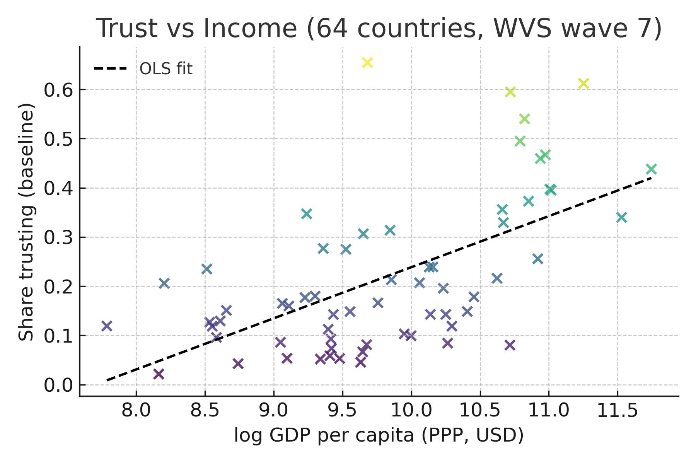

# Income and Interpersonal Trust
*World Values Survey Wave 7*  

---

## 1. Motivation

Trust lubricates social and economic interaction. Classical growth models treat trust as
an informal institution that lowers transaction costs; empirical work often finds that
high‑trust societies grow faster and innovate more. Here we ask a simpler descriptive
question: **are richer countries also more trusting?**

## 2. Data

- **Coverage:** 64 country‑surveys from WVS Wave 7 (2017‑2022).
- **Income:** GDP per capita, PPP‑adjusted USD (World Bank).
- **Trust:**  
  • *Baseline* – share answering “Most people can be trusted” (Q57).  
  • *Alternative* – average of Q59–Q63 (trust in neighbours, acquaintances, first‑time met, other religion, other nationality), reverse‑coded.

## 3. Exploratory pattern

Both the LOESS smoother and the dashed OLS line suggest a positive association. Annotated
points mark extreme income positions (rich: MAC, SGP, NLD; poor: ETH, ZWE, TJK) and trust
outliers.

## 4. Regression analysis

### Baseline trust

β₁ = 0.104  (SE 0.018, p = 0.000, R² = 0.35)  

### Alternative trust index

β₁ = 0.137  (SE 0.030, p = 0.000, R² = 0.25)

## 5. Interpretation

A one‑unit rise in log‑income (≈ 2.7× GDP per capita) is associated with a 0.104-point
increase in the share trusting (scale 0–1). While not large, this accounts for roughly 35%
of cross‑country variation.
Channels could include better governance, education and formal institutions in high‑income
settings, which foster generalised trust. Reverse causality—trust as a driver of
growth—remains plausible.

## 6. Limitations & robustness

- Cross‑section only; cannot infer causality.
- Small N; high‑trust outlier (CHN) influences slope.
- Aggregate averages hide within‑country disparities.

## 7. Short assignment prompt

**For students:**

1. Replicate the scatter plot; label one additional country of your choice.
2. Re‑estimate the regression adding a regional fixed effect (e.g. Europe vs. rest). How does β₁ change?
3. Propose two mechanisms linking income and trust and outline an empirical strategy to test one of them.
4. Critique the trust measures used here.

---

*Prepared 21 Apr 2025*